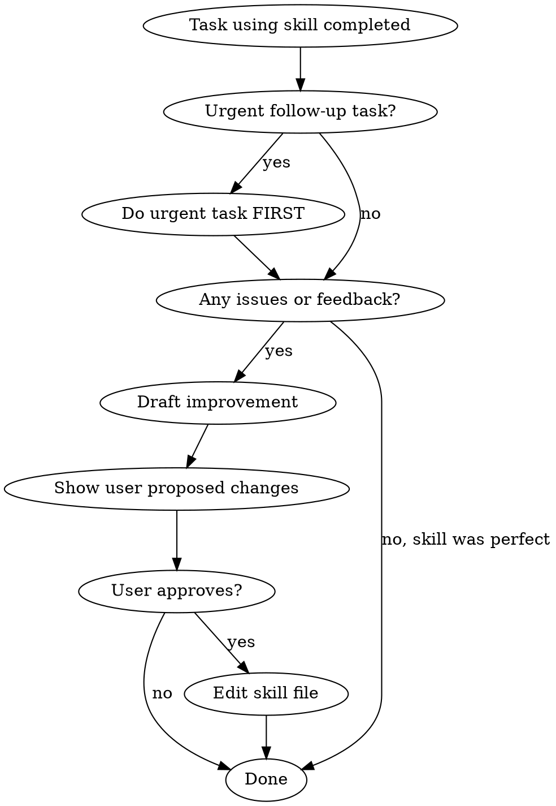

# Improving Skills

## Overview

After using any skill from this project's `.agents/skills/` directory, collect feedback and propose improvements. Skills improve through use — gaps found today become fixes tomorrow.

## When This Applies

**Trigger after using ANY skill in `.agents/skills/`** (this repo's skills, not superpowers).

How to know: If you invoked a skill for this starfleet repo and completed the task, invoke this skill next.

## Feedback Collection

After completing the task that used the skill, ask yourself:

| Question | Why It Matters |
|----------|----------------|
| What was missing? | Gaps cause future agents to repeat workarounds |
| What was unclear? | Confusing sections slow everyone down |
| What was most useful? | Confirms what to keep/expand |
| What was wrong? | Errors propagate if not fixed |

## Workflow



**Key point:** If there's an urgent follow-up task, handle it first — but you MUST still provide skill feedback before the session ends. "Later" in an ephemeral session means "never."

## Proposing Changes

**Always propose before editing.** Format:

```markdown
## Skill Improvement Proposal

**Skill:** [skill-name]
**Issue:** [gap/unclear/wrong/enhancement]

**Current content:**
[quote relevant section or "missing"]

**Proposed change:**
[new or revised content]

**Rationale:**
[why this helps future agents]
```

After user approves, edit the skill file directly.

This takes 30 seconds, not 30 minutes. A quick proposal with a one-sentence rationale is enough — don't over-formalize it.

## Red Flags - You're Skipping Feedback

| Thought | Reality |
|---------|---------|
| "The skill worked, nothing to report" | Positive confirmation helps too — what worked well? |
| "Reporting feels like extra work" | 30 seconds of feedback saves hours of repeated workarounds |
| "User didn't ask for feedback" | This skill IS asking for feedback — you have permission |
| "It's not my job to improve docs" | Every agent using skills should improve them |
| "I'll come back to this later" | You won't. Sessions are ephemeral. Later = never. Write it now. |
| "I'll invoke this skill later" | Invoke NOW while context is fresh. Later = never. |
| "This is too minor to report" | Minor issues compound. Report it. |
| "That skill isn't my domain" | You used it. You found gaps. You're the best person to report them right now. |
| "The skill owner should fix it" | There is no single owner. Every user is a maintainer. |
| "I need to prioritize the user's next request" | Handle urgent work first, then provide feedback. Both matter. |
| "Feedback would create context-switching friction" | A 30-second proposal isn't a context switch — it's a note. |

## What NOT to Report

- Typos (fix silently if obvious)
- Style preferences (skills have varied styles, that's fine)
- Hypothetical improvements ("someday we might need...")
- Changes to superpowers skills (those have their own process)

## Example Improvements

**Gap found:**
> Backlog skill didn't cover how to handle issues that span both starfleet and tubernetes repos. Added cross-repo issue linking guidance.

**Unclear section:**
> The `gh project item-edit` section didn't clarify which fields can be set via CLI vs require the GitHub UI. Added a table.

**Worked well:**
> The agent team structure in prioritizing-backlog saved significant time on data gathering. Consider similar patterns for other data-heavy skills.
