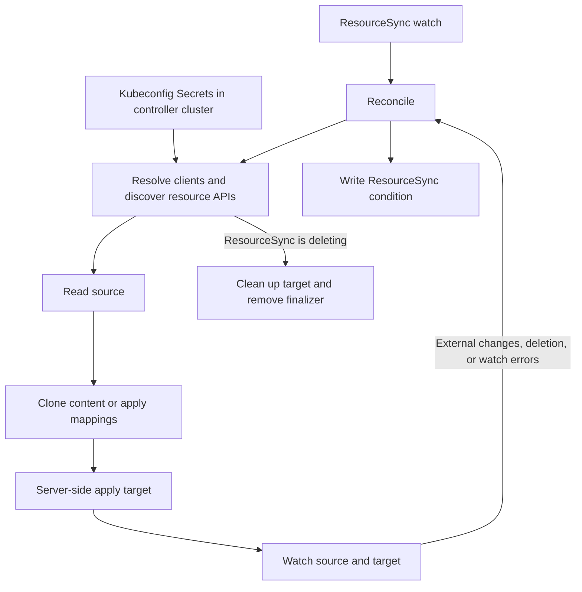

# Sinker

Sinker is a Kubernetes controller that copies resources, or selected fields, from a source object to a target object.
Each `ResourceSync` defines a one-way synchronization within one cluster or between clusters. Sinker watches both
objects and reapplies the desired target when they change.

## Features

- Copy whole resources or select fields with JSONPath source expressions and dotted destination paths.
- Connect either end to another cluster using a kubeconfig stored in a Kubernetes Secret.
- Share kubeconfig Secrets across namespaces with an explicit namespace access annotation.
- Store arbitrary structured data in `SinkerContainer` resources for use as sources or targets.
- Manage target cleanup through a finalizer and report reconciliation results in `ResourceSync` status.

## Getting started

### Prerequisites

- A Kubernetes cluster for the controller and its CRDs, with permission to install CRDs, RBAC, and a Deployment.
  The bundled schema uses CEL validation, and target writes use server-side apply. The repository selects Kubernetes
  1.33 API bindings at build time; this is not a tested minimum cluster version.
- `kubectl` with Kustomize support.
- The Rust toolchain selected by [rust-toolchain.toml](rust-toolchain.toml), currently `1.98.1`, when building locally.
- An OCI image builder and a registry accessible to the cluster when building your own container image.
- For remote clusters, network access from the controller and a usable kubeconfig for each connection.

### Build the controller

```bash
git clone https://github.com/influxdata/sinker.git
cd sinker
cargo build --locked --release
```

The binary is `target/release/sinker`. To build and publish your own image, replace the registry and tag below:

```bash
docker build -t <registry>/sinker:<tag> .
docker push <registry>/sinker:<tag>
```

The [Dockerfile](Dockerfile) uses cargo-chef for build caching and a distroless Debian 12 runtime running as UID/GID
`65532:65532`. CI also publishes images; see [Development](#development) for the publication workflow.

### Deploy to Kubernetes

The [bundled manifests](manifests/kustomization.yaml) install both CRDs, a namespace, RBAC, a ServiceAccount, and a
single-replica Deployment. Customize [deployment.yml](manifests/deployment.yml), directly or through an overlay:

- Replace the `sinker:replace_me` image with an image you can pull.
- Configure the `gar-auth-sinker` image pull Secret, or remove/change `imagePullSecrets` for your registry.
- Adjust resource requests and limits: the defaults request **2 CPUs and 3G memory**, with an **8 CPU** limit.
- Extend [clusterrole.yml](manifests/clusterrole.yml) if you need additional resource kinds; see [Permissions](#permissions).

If the registry requires a pull Secret, create the namespace first:

```bash
kubectl apply -f manifests/namespace.yaml
kubectl -n sinker create secret docker-registry gar-auth-sinker \
  --docker-server=<registry> \
  --docker-username=<username> \
  --docker-password=<password>
```

After customizing the manifests, render, apply, and check the Deployment:

```bash
kubectl kustomize manifests
kubectl apply -k manifests
kubectl -n sinker rollout status deployment/sinker
kubectl -n sinker logs deployment/sinker
```

Sinker watches `ResourceSync` objects in **all namespaces**. Keep one active controller per cluster: the implementation
has no leader election. The admin server listens on port `8080`; see [Status and observability](#status-and-observability).

### Running locally against a cluster

Install the CRDs in the cluster selected by your kubeconfig, then run:

```bash
kubectl --kubeconfig /path/to/kubeconfig --context my-context apply -f manifests/crd.yml
kubectl --kubeconfig /path/to/kubeconfig --context my-context wait --for=condition=Established \
  --timeout=60s crd/resourcesyncs.sinker.influxdata.io crd/sinkercontainers.sinker.influxdata.io
cargo run --locked -- --kubeconfig /path/to/kubeconfig --context my-context
```

Use a cluster without another active Sinker controller. Local execution needs the same API permissions as a deployed
controller. Credentials are loaded from `--kubeconfig`, then `KUBECONFIG` or `~/.kube/config`; without explicit client
selection, a failed local configuration falls back to in-cluster credentials.

Run `cargo run --locked -- --help` for the full CLI. These options configure the controller's local connection and runtime:

| Option | Purpose / default |
| --- | --- |
| `--log-level` / `SINKER_LOG` | Tracing filter; `sinker=info,warn`. |
| `--log-format` | `plain` or `json`; defaults to `plain`. |
| `--kubeconfig`, `--context`, `--cluster`, `--user` | Select the local kubeconfig and its entries. |
| `--as`, `--as-group` | Set kubeconfig user/group impersonation. |
| `--kube-api-response-headers-timeout` | Local Kubernetes client response-header timeout; `9s`. |
| `--admin-addr` | Admin HTTP bind address; `0.0.0.0:8080`. |

Remote clients use the kubeconfigs referenced in each `ResourceSync`; local client flags do not override those connections.

## Defining resource syncs

Both CRDs use `apiVersion: sinker.influxdata.io/v1alpha1` and are namespaced.

### ResourceSync

For a simple in-cluster sync, create a source ConfigMap:

```bash
kubectl -n default create configmap sinker-source --from-literal=message=hello
```

Save this as `resource-sync.yaml`, then run `kubectl apply -f resource-sync.yaml`:

```yaml
apiVersion: sinker.influxdata.io/v1alpha1
kind: ResourceSync
metadata:
  name: demo
  namespace: default
spec:
  source:
    resourceRef:
      apiVersion: v1
      kind: ConfigMap
      name: sinker-source
  target:
    resourceRef:
      apiVersion: v1
      kind: ConfigMap
      name: sinker-target
```

Inspect the result with `kubectl -n default get configmap sinker-target -o yaml` and
`kubectl -n default get resourcesync demo -o yaml`. Changes to the source are copied to the target; external changes to
fields Sinker manages on the target trigger another apply. Deleting the source causes reconciliation errors and leaves
an existing target in place. Deleting the `ResourceSync` initiates [target cleanup](#annotations-and-finalizers).

| Field | Required | Meaning |
| --- | --- | --- |
| `spec.source.resourceRef` | Yes | Source `apiVersion`, `kind`, and `name`. |
| `spec.target.resourceRef` | Yes | Target `apiVersion`, `kind`, and `name`. |
| `spec.source.cluster` | No | Source kubeconfig reference and optional resource namespace override. |
| `spec.target.cluster` | No | Target kubeconfig reference and optional resource namespace override. |
| `spec.mappings` | No | Ordered field mappings. Omitted or `[]` copies the source's content, labels, and annotations. |

**The checked-in CRD makes the entire `spec` immutable**, including mappings. Replace the `ResourceSync` to change its
spec, accounting for target deletion when removing the old sync. This restriction is enforced by the installed schema;
the generator currently omits the rule. See [Generating CRDs](#generating-crds) before updating or packaging schemas.

### Cluster references and namespaces

Without `cluster`, a namespaced source or target is resolved in the `ResourceSync`'s namespace using the controller's
local client. `resourceRef` has no namespace field. To use a kubeconfig, add this under either `source` or `target`:

```yaml
cluster:
  namespace: workloads
  kubeConfig:
    secretRef:
      name: remote-kubeconfig
      namespace: cluster-credentials
      key: value
```

The two namespace fields have different meanings:

| Field | Location | Default when omitted |
| --- | --- | --- |
| `cluster.kubeConfig.secretRef.namespace` | Namespace of the Secret in the **controller's cluster**. | `ResourceSync` namespace. |
| `cluster.namespace` | Namespace of the source/target in the **referenced cluster**. | Selected kubeconfig context's namespace, or `default`. |

Discovery determines whether a kind is namespaced or cluster-scoped. Cluster-scoped API requests use no resource
namespace; see the [local target ownership limitation](#annotations-and-finalizers) before using such a target.

Create the kubeconfig Secret in an existing namespace. This example authorizes syncs in `default` to use credentials
stored in `cluster-credentials`:

```bash
kubectl -n cluster-credentials create secret generic remote-kubeconfig \
  --from-file=value=/path/to/remote-kubeconfig
kubectl -n cluster-credentials annotate secret remote-kubeconfig \
  'sinker.influxdata.io/allowed-namespaces=^default$'
```

The `sinker.influxdata.io/allowed-namespaces` annotation belongs to the **kubeconfig Secret**. Its value is a Rust regular
expression matched against the **ResourceSync namespace**. Use anchors for exact matches, for example
`^(team-a|team-b)$`; matching is otherwise not anchored. Cross-namespace access is denied when the annotation is absent,
invalid, or does not match. Same-namespace Secret references do not require this annotation. A failed cross-namespace
Secret read also reports the generic namespace-restriction error.

The Secret key must contain a UTF-8 kubeconfig with a usable current context. Any referenced files or credential helper
executables must be available inside the controller container; the supplied distroless image includes no cloud CLI
helpers. A self-contained kubeconfig avoids dependencies on workstation files.

[example.yaml](example.yaml) shows remote-to-local field mapping. It requires the Secret `k3-test-27-kubeconfig` in
`default` and a remote `ConfigMap/default/remote-demo` containing `data.remote` and `data.foo`.

### Permissions

Sinker uses the controller's credentials for local resources and kubeconfig Secret reads, and the referenced kubeconfig's
identity for remote resources. It does not impersonate the creator of a `ResourceSync`. Grant the ability to create syncs
and authorize shared credentials according to the resources those identities can access.

The bundled ClusterRole supplies access to `ResourceSync`, `SinkerContainer`, ConfigMaps, and Secrets, plus read access to
Namespaces. Dynamic resource discovery does not grant access to other kinds: add RBAC for them on the relevant cluster.
Source operations require `get` and `watch`; targets require `get`, `watch`, `patch` for server-side apply, and `delete`
for cleanup. API discovery and remote server-version requests must also be allowed. The controller additionally needs
cluster-wide list/watch access to `ResourceSync`, status updates, and finalizer management, as provided by the bundle.

### Mappings

With no mappings, Sinker copies the source's non-metadata fields, labels, and annotations into a target with the requested
name and discovered type. It drops `kubectl.kubernetes.io/last-applied-configuration` and does not copy source UIDs,
resource versions, owner references, or finalizers.

With mappings, Sinker starts with an empty target and processes entries in order:

| Mapping | Behavior |
| --- | --- |
| Both `fromFieldPath` and `toFieldPath` | Select a source value and place it at the destination. |
| Only `toFieldPath` | Place the entire source object at the destination, such as `spec` in a `SinkerContainer`. |
| Only `fromFieldPath` | Treat the selected subtree as a Kubernetes object and replace the target template with it. The subtree must contain `apiVersion` and `kind` matching the target reference. |
| Neither field | Reconciliation error; use an empty mappings list for a whole-resource copy. The CRD does not reject an empty mapping entry. |

Source paths are JSONPath expressions **without a leading `$` or `$.`**: Sinker prepends `$.` to nonempty paths.
For example, `data.foo`, `spec.items[0]`, or `metadata.annotations['example.com/key']`. An omitted or empty
`fromFieldPath` selects the whole source. No match produces JSON `null`; multiple matches cause a reconciliation error.

Destination paths are dot-separated object keys, such as `data.bar` or `metadata.labels`. They create missing objects
but cannot traverse a scalar, index an array, or escape a dot within a key. To copy keys containing dots, map their whole
parent object, such as `data` or `metadata.annotations`. An empty `toFieldPath` is not a root replacement; omit it for that.

For example, to copy only the demo ConfigMap's `data.message` to `data.copiedMessage`, add this to the sync's initial spec:

```yaml
mappings:
  - fromFieldPath: data.message
    toFieldPath: data.copiedMessage
```

All target writes use **forced server-side apply** with field manager `sinker.influxdata.io`. Sinker can take ownership of
conflicting fields on an existing target. Other fields follow Kubernetes apply and schema rules; a sync is not an exact
byte-for-byte clone. Sinker writes to the main resource endpoint, so mapping `status.*` does not update a separate
[`/status` subresource](https://kubernetes.io/docs/tasks/extend-kubernetes/custom-resources/custom-resource-definitions/#status-subresource).

### SinkerContainer

`SinkerContainer` holds an arbitrary JSON object under `.spec`, with unknown fields preserved by its manual schema. It
has no separate reconciliation loop. Use it to collect selected data or hold an embedded Kubernetes object:

```yaml
apiVersion: sinker.influxdata.io/v1alpha1
kind: SinkerContainer
metadata:
  name: config-template
  namespace: default
spec:
  apiVersion: v1
  kind: ConfigMap
  data:
    message: hello
```

To materialize this embedded ConfigMap, reference `config-template` as the source, a `v1` ConfigMap as the target, and
use `mappings: [{fromFieldPath: spec}]`. Conversely, `mappings: [{toFieldPath: spec}]` stores an entire source object in
a target `SinkerContainer`.

## Annotations and finalizers

Sinker adds `sinker.influxdata.io/target` to the `ResourceSync` before applying the target. On deletion, it requests target
deletion and waits until the target is absent before stopping the watches and removing its finalizer. It uses background
deletion when the target already has finalizers, and foreground deletion otherwise. A target's own finalizers can keep
cleanup pending. Existing targets adopted by a sync are subject to the same cleanup.

These annotations belong to the **ResourceSync** and are enabled only by the string `"true"`:

| Annotation | Effect |
| --- | --- |
| `sinker.influxdata.io/disable-target-deletion: "true"` | Skip Sinker issuing the target delete request, stop watches, and remove Sinker's finalizer. |
| `sinker.influxdata.io/force-delete: "true"` | During deletion, remove Sinker's finalizer if constructing either source or target API fails, for example because credentials or a remote API are unavailable. It does not bypass errors from subsequent target GET/DELETE requests or a target's finalizers. |

Both source and target APIs are resolved before normal cleanup, even with `disable-target-deletion`. An unavailable
source cluster can therefore block cleanup too. Force deletion can leave a target behind for manual cleanup.

Local targets (`target.cluster` omitted) also receive an owner reference to the namespaced `ResourceSync`.
**Disabling target deletion alone does not retain a local target**: Kubernetes garbage collection can still delete it.
Retention must also account for Kubernetes [orphaning behavior](https://kubernetes.io/docs/concepts/architecture/garbage-collection/#orphaned-dependents).
The controller currently adds this owner reference even to a local cluster-scoped target, which conflicts with Kubernetes
[owner scope rules](https://kubernetes.io/docs/concepts/architecture/garbage-collection/#owners-and-dependents).
Targets configured through a kubeconfig receive no Sinker owner reference, even if that kubeconfig points at the local cluster.

## Status and observability

`status.conditions` contains `ResourceSyncFailing`: `"True"` with an error message after failure, or `"False"` with reason
`ResourceSyncSucceeded` after successful reconciliation. It records `observedGeneration` and preserves `lastTransitionTime`
while the condition value stays the same, using the live status rather than the watch cache. A successful finalizer-only
initialization also reports `"False"`, so inspect the target when verifying the first sync. Successful deletion cleanup
does not write status.

```bash
kubectl get resourcesyncs -A
kubectl -n default get resourcesync demo -o yaml
kubectl -n sinker logs deployment/sinker --tail=100
kubectl -n sinker port-forward deployment/sinker 8080:8080
# In another terminal:
curl http://localhost:8080/live
curl http://localhost:8080/ready
```

The admin server provides `/live` and `/ready`. Readiness reflects runtime initialization and shutdown, not the health
of individual syncs or remote clusters. **There is currently no registered `/metrics` endpoint**; enabling the dependency's
Prometheus feature does not configure an exporter in [main.rs](src/main.rs).

Reconciliation errors retry after five seconds; object watches reconnect with backoff. A healthy sync waits for events
rather than polling on a fixed interval. Metadata-only edits to `ResourceSync` and changes to kubeconfig Secrets are not
explicit reconciliation triggers. Existing watches keep their clients until they reconnect. A retry or subsequent object
event can pick up updated settings; restart the controller when credential or access changes need to take effect promptly.

For failures, check the condition message, referenced object names, resource and Secret namespaces, the Secret's selected
key and access annotation, RBAC, and connectivity to both API servers. If startup logs say the CRD is not queryable,
check CRD installation and list permissions. Debug logging includes source objects and mapped values, which can include
Secret contents.

## How it works



The controller filters `ResourceSync` events by generation to avoid loops from its own status writes. The watcher manager
keeps a watcher per resource reference and owning sync, for local and remote endpoints. Object watches use
`metadata.name` selectors and managed-field timestamps to suppress changes last attributed to `sinker.influxdata.io`;
events with unknown ownership trigger reconciliation. Shutdown cancels and joins the watchers.

## Generating CRDs

`sinker manifests` emits only the two CRDs; it needs no cluster connection. Compare generated output in a temporary file
before replacing the checked-in schema:

```bash
cargo run --locked -- manifests > /tmp/sinker-crds.yaml
diff -u manifests/crd.yml /tmp/sinker-crds.yaml
```

**Known drift:** [manifests/crd.yml](manifests/crd.yml) includes the `self == oldSelf` validation on `ResourceSync.spec`;
[resources.rs](src/resources.rs) does not generate it. The comparison currently reports that rule missing. Replacing the
checked-in file with generated output would remove spec immutability. CI regenerates `manifests/crd.yml` and checks for a
clean diff, so this mismatch also affects the generation check. Preserve the rule when packaging until its generation is
reconciled with the manifest.

Use `kubectl kustomize manifests` to render the complete deployment bundle.

## Development

Sinker is a single Rust package with a binary and library. The [CI workflow](.github/workflows/rust.yml) builds, checks
formatting and CRD drift, runs tests, and runs Clippy. Equivalent local checks, with formatting kept read-only, are:

```bash
cargo build --locked
cargo fmt --check
cargo test --locked
cargo clippy --locked --all-targets --all-features
```

Tests are inline unit tests for mappings, status transitions, annotations, namespace access checks, and event filtering.
They do not establish end-to-end behavior against a live Kubernetes API. Use the [CRD comparison](#generating-crds) when
changing resource definitions.

| Source | Read when changing |
| --- | --- |
| [main.rs](src/main.rs), [lib.rs](src/lib.rs) | CLI, runtime wiring, public modules, and shared errors. |
| [resources.rs](src/resources.rs) | Serialized API fields, annotations, and the manual `SinkerContainer` schema. |
| [controller.rs](src/controller.rs) | Reconciliation, server-side apply, status, ownership, and cleanup. |
| [resource_extensions.rs](src/resource_extensions.rs) | Client creation, namespace resolution, discovery, and kubeconfig Secret authorization. |
| [mapping.rs](src/mapping.rs) | Source selection, destination construction, and metadata handling. |
| [remote_watcher.rs](src/remote_watcher.rs), [remote_watcher_manager.rs](src/remote_watcher_manager.rs), [filters.rs](src/filters.rs) | Watch lifecycle, retries, and filtering of Sinker-generated events. |
| [manifests/](manifests/), [Dockerfile](Dockerfile), [rust.yml](.github/workflows/rust.yml) | Deployment defaults, RBAC, packaging, and publication. |

On successful pushes to `main`, CI builds `linux/amd64` and `linux/arm64` images at
`us-docker.pkg.dev/influxdb2-artifacts/tubernetes/sinker:<commit-sha>`, updates the manifest image for publication, and
publishes a Flux OCI artifact under `sinker-manifests` in the same registry. This workflow requires the configured
registry credentials and Depot project; building your own image does not require access to that infrastructure.

Sinker is licensed under the [MIT License](LICENSE).
